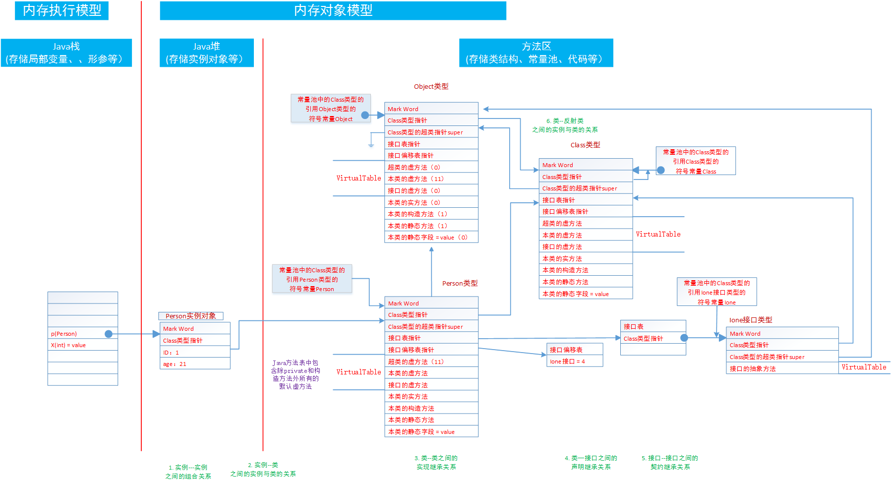

# 深入理解 Java 虚拟机 学习笔记

<!-- TOC -->

- [深入理解 Java 虚拟机 学习笔记](#深入理解-java-虚拟机-学习笔记)
    - [第二章 Java 内存区域与内存溢出异常](#第二章-java-内存区域与内存溢出异常)
        - [内存区域](#内存区域)
        - [对象创建](#对象创建)
        - [对象的内存布局](#对象的内存布局)
        - [对象访问](#对象访问)
    - [参考](#参考)

<!-- /TOC -->

---

## 第二章 Java 内存区域与内存溢出异常

### 内存区域

-- from 姜志明
### 对象创建

1. 加载类
    - 若已经在内存中则跳过。
    - **类加载完以后就可以确定对象所需的空间大小** // TODO why?
1. 分配内存
    - 根据 GC 回收算法的不同，分配方式略有区别。
        - 标记整理算法，使用空闲列表
        - 带压缩的算法，使用指针碰撞（已分配和未分配内存间由指针分隔）
1. 内存清零
1. 对象初始化

### 对象的内存布局

- MarkWord 占用一个 **字** 的大小，其中分为两部分：
    1. 对象自身运行时元数据。例如，哈希码、GC 分代年龄、锁状态标志等等
    1. 类型指针。指向其类的元数据。
    1. 若对象是数组则还需要保存数组的长度。
- 域的存储顺序：
    1. 基本类型优先，长度长的优先。
    1. 父类域优先。子类较短域可插入父类域空隙。
    1. 受虚拟机分配策略参数和域定义顺序的影响。

### 对象访问

两种方式：

1. 直接引用
1. 引用句柄（句柄池）

## 参考

1. 郑州大学姜志明老师课件