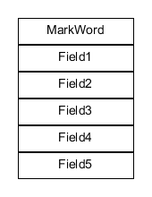
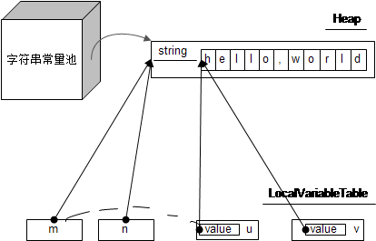

# 深入理解 Java 虚拟机 学习笔记

<!-- TOC -->

- [深入理解 Java 虚拟机 学习笔记](#深入理解-java-虚拟机-学习笔记)
    - [第二章 Java 内存区域与内存溢出异常](#第二章-java-内存区域与内存溢出异常)
        - [内存区域](#内存区域)
            - [对象创建](#对象创建)
            - [对象的内存布局](#对象的内存布局)
            - [对象访问](#对象访问)
        - [内存溢出异常](#内存溢出异常)
            - [常用 JVM 参数 （Java HotSpot VM）](#常用-jvm-参数-java-hotspot-vm)
            - [常见异常及可能原因](#常见异常及可能原因)
            - [String 与字符串常量](#string-与字符串常量)
    - [参考](#参考)

<!-- /TOC -->

---

## 第二章 Java 内存区域与内存溢出异常

### 内存区域


-- from 姜志明
#### 对象创建

1. 加载类
    - 若已经在内存中则跳过。
    - **类加载完以后就可以确定对象所需的空间大小** // TODO why?
1. 分配内存
    - 根据 GC 回收算法的不同，分配方式略有区别。
        - 标记整理算法，使用空闲列表
        - 带压缩的算法，使用指针碰撞（已分配和未分配内存间由指针分隔）
1. 内存清零
1. 对象初始化

#### 对象的内存布局



- MarkWord 占用一个 **字** 的大小，其中分为两部分：
    1. 对象自身运行时元数据。例如，哈希码、GC 分代年龄、锁状态标志等等
    1. 类型指针。指向其类的元数据。
    1. 若对象是数组则还需要保存数组的长度。
- 域的存储顺序：
    1. 基本类型优先，长度长的优先。
    1. 父类域优先。子类较短域可插入父类域空隙。
    1. 受虚拟机分配策略参数和域定义顺序的影响。

#### 对象访问

两种方式：

1. 直接引用
1. 引用句柄（句柄池）

### 内存溢出异常

#### 常用 JVM 参数 （Java HotSpot VM）

|参数|含义|实例|
|:---|:---|:---|
|-verbose:class|显示每一个被加载的类的信息||
|-verbose:gc|显示每一个 GC 事件的信息||
|-Xmnsize|年轻代最大容量|-Xmn256m|
|-Xmssize|堆的初始大小。1024 的整数倍并且要大于 1MB|-Xms6m|
|-Xmxsize|堆的最大容量。1024 的整数倍并且要大于 2MB|-Xmx80m|
|-Xsssize|线程栈容量。平台不同默认值不同，详情参考文档。Linux/x64 (64-bit): 1024 KB|-Xss1m|
|-XX:MaxDirectMemorySize=size|直接内存的最大容量，默认与堆容量相同|-XX:MaxDirectMemorySize=1m|
|-XX:+HeapDumpOnOutOfMemory|当抛出 OOM 时，使用 HPROF 将堆的快照保存到当前目录||
|-XX:HeapDumpPath=path|设置快照输出路径|-XX:HeapDumpPath=/var/log/java/java_heapdump.hprof|
|-XX:+PrintGCDetails|开启在 GC 时打印详细信息||
|-XX:SurvivorRatio=ratio|新生代中 eden 与 survivor 的大小比例，默认为 8|-XX:SurvivorRatio=4|

参考： [Java HotSpot VM 参数](http://docs.oracle.com/javase/8/docs/technotes/tools/unix/java.html)

#### 常见异常及可能原因

- 堆区
    - `OutOfMemoryException`。使用工具对快照进行分析，看是否发生了内存泄露（内存中有不再使用的但无法回收的对象或资源）。若是，则通过分析引用链找到根源，解决问题；若不是检查虚拟机堆参数，看是否能够调大。再检查代码中是否有生命周期很长的大对象。
- 虚拟机栈和本地方法栈
    - `OutOfMemoryException`。栈容量 * 线程数量 = 固定值。当线程数量过多时会引发，可以适当减小栈容量。
    - `StackOverflowException`。按异常查根源。
- 方法区和运行时常量池
- 直接内存溢出
    - 不正确的使用 NIO。 
    
#### String 与字符串常量

```java
public class StringTest {
	public static void main(String[] args) {
		String m = "hello";
		String n = "hello";
		String u = new String(m);
		String v = new String("hello");
		
		System.out.println("m == n: " + (m == n));
		System.out.println("m == u: " + (m == u));
		System.out.println("m == v: " + (m == v));
		System.out.println("u == v: " + (u == v));
	}
}

output:
m == n: true
m == u: false
m == v: false
u == v: false
```



参考： [初探Java字符串](http://mccxj.github.io/blog/20130615_java-string-constant-pool.html)


## 参考

1. 郑州大学姜志明老师课件
1. [初探Java字符串](http://mccxj.github.io/blog/20130615_java-string-constant-pool.html) (非常好的一篇文章)
1. [Java HotSpot VM 参数](http://docs.oracle.com/javase/8/docs/technotes/tools/unix/java.html)
1. [Java HotSpot Virtual Machine Garbage Collection Tuning Guide](http://docs.oracle.com/javase/8/docs/technotes/guides/vm/gctuning/index.html)